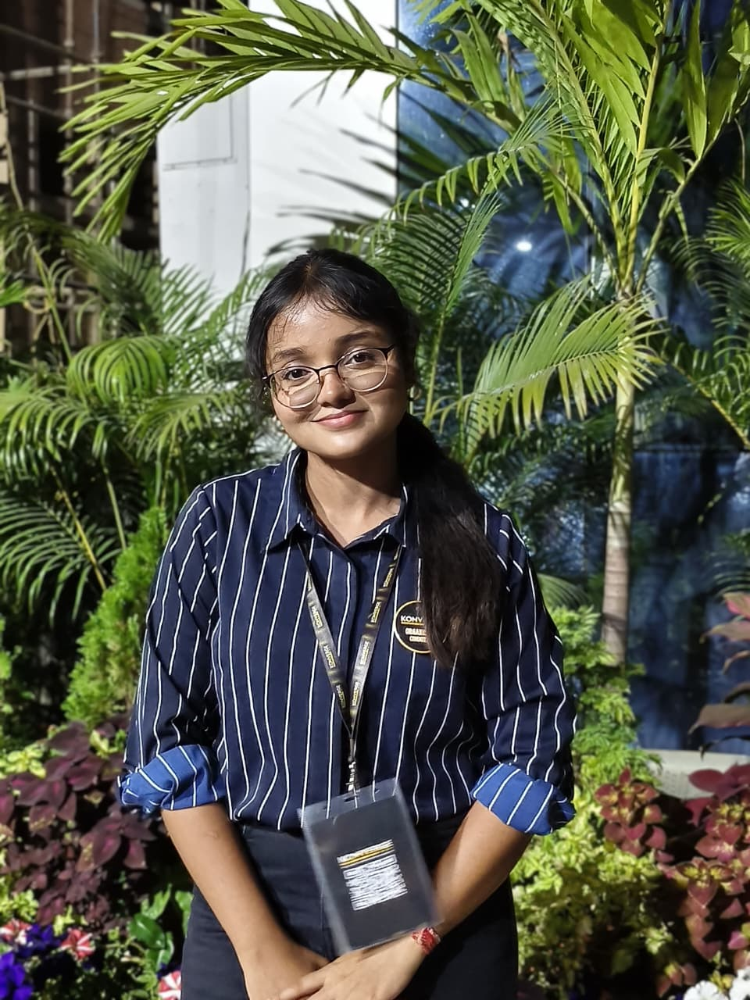

<table>
<tr>

<td width="62%" valign="center">

# Hi there 👋

I'm **Amrita Neogi**, a **third-year Computer Science Engineering student** at **KIIT University**.

I enjoy designing modern, responsive web experiences and continuously expanding my knowledge of backend systems, DevOps, and cloud technologies. My goal is to build software that is not only visually appealing but also scalable, efficient, and impactful.

 

 

</td>

<td width="38%" align="center">

</td>

</tr>
</table>

---

# 💻 Tech Stack

---

# 🚀 Currently Exploring

<table>
<tr>
<td>🌐 Frontend Development</td>
<td>⚙️ Spring Boot</td>
</tr>

<tr>
<td>⚛️ Next.js</td>
<td>🐳 Docker</td>
</tr>

<tr>
<td>☁️ AWS Cloud</td>
<td>🔧 DevOps Practices</td>
</tr>
</table>

---

# 📊 GitHub Analytics

---

---

### *"Building interfaces today. Engineering scalable systems tomorrow."*

